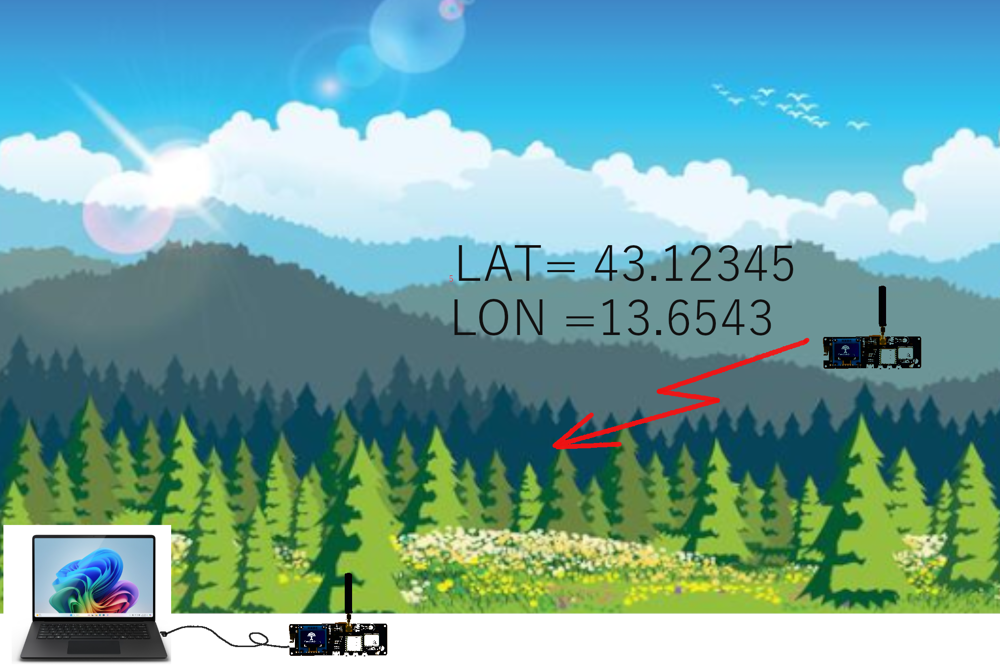

# Lora Communication with first Lilygo T-Beam sending its Latitude and longitude with UBX-NAV-SAT signal to a second Lilygo T-Beam


This project implements a GPS data transmission system using two TTGO T-Beam boards (ESP32 with LoRa and GPS capabilities). One T-Beam acts as a **sender** that reads GPS coordinates from a u-blox GNSS module and transmits them via LoRa radio, while the other acts as a **receiver** that listens for these transmissions and displays the received data over serial.

First in setup a message from ESP32 to Ubox Neo M8N, that configures UBX-NAV-SAT messages to Lilygo T-Beam ESP32, and then in Loop, from this message a longitude and latitude is extracted. These coordinates, together with information about GPS signal quality is transmitted to the second  Lilygo T-Beam, which prints out the data.  




## 1. Sender with GPS 

1. **GPS Initialization & Configuration**

   - Powers the GPS module via the AXP2101 PMIC (power management IC) The program attempts to communicate with the AXP2101 chip (which manages the voltages). If it finds a signal, it activates the output that powers the GPS (3.3V). Otherwise, it displays a warning.

   - Configures the u-blox GPS to output only UBX binary protocol (disables NMEA sentences) Enables NAV-PVT (Position, Velocity, Time) messages at 1Hz rate on UART1
   - Initializing the GPS serial port:
    This opens a 9600 baud UART connection between the ESP32 and the GPS (pins 34 for receiving, 12 for transmitting).

   - Configuring the GPS:
    By default, the GPS sends many NMEA sentences (GGA, GSA, RMC, etc.). The program disables them all one by one by sending UBX configuration commands.

   - Then it activates a single UBX message called NAV-PVT (which contains the    position, speed, time, altitude, etc.).
    For each command, it waits for the GPS acknowledgment response (ACK or NAK) and displays whether it was successful.

2. **UBX Protocol Parsing**
   - Implements a robust state machine parser for UBX binary protocol
   - Extracts latitude, longitude, fix type, and validity flags from NAV-PVT frames
   - Stores the latest valid position data

3. **LoRa Transmission**
   - Uses RadioLib library for SX1262 LoRa transceiver control
   - Transmits formatted GPS data string: `LAT=xx.xxxxxxx LON=xx.xxxxxxx valid=true/false fixType=0-3`
   - Operates at 868 MHz (EU ISM band)


## 2. Receiver  
1. **Continuous Listening**
   - Initializes SX1262 LoRa receiver at same frequency (868 MHz)
   - Listens for incoming transmissions in a continuous loop
   - Displays received messages on Serial Monitor

2. **Error Handling**
   - Reports transmission errors and timeouts
   - Shows success/failure status for each received packet


## Hardware / Components Used

### Boards
- **2 × LILYGO Lilygo T-Beam V1.2**
  - MCU: **ESP32**
  - LoRa radio: **SX1262**
  - GPS: **NEO-M8N**
  - PMU: **AXP2101**
  - USB-UART: **CH9102**
  - Flash: 4MB, PSRAM: 8MB
  - Marking: *LILYGO 868/915 MHz Model: LORA32 SX1262*


### Building and Uploading

#### Select the Environment

The project has two build defined in platformio.ini:

- **sender** - Compiles sender.cpp + SendOwnInfo.cpp (GPS transmission)
- **receiver** - Compiles only receive.cpp (LoRa receiver code)


### Build & Upload to Receiver T-Beam

```bash
# Using PlatformIO CLI
pio run -e receiver --target upload

# Or in VS Code:
# Click the "PlatformIO" icon → "Project Tasks" → "receiver" → "Upload"
```

### Monitor Serial Output

```bash
# Monitor sender (GPS coordinates)
pio device monitor -e sender

# Monitor receiver (received messages)
pio device monitor -e receiver
```

**Note:** If you have both T-Beams connected simultaneously, specify the correct COM port:
```bash
pio device monitor --port COM3   # Windows
pio device monitor --port /dev/ttyUSB0  # Linux/Mac
```

## What is LoRa?

**LoRa** (Long Range) is a wireless modulation technology developed by Semtech that enables low-power, long-range communication for IoT (Internet of Things) devices. It uses a proprietary spread-spectrum technique called Chirp Spread Spectrum (CSS) to achieve:

- **Long range:** Up to 15+ km in rural areas, 2-5 km in urban environments
- **Low power:** Devices can operate for years on a single battery
- **Low data rate:** Typically 0.3 kbps to 50 kbps (perfect for sensor data)
- **Excellent penetration:** Can penetrate buildings and obstacles better than WiFi/BLE

LoRa operates in the license-free ISM bands (868 MHz in Europe, 915 MHz in North America, 433 MHz in Asia). It's ideal for applications like:
- GPS tracking
- Environmental monitoring
- Smart agriculture
- Asset tracking
- Smart city sensors

## Expected Output

### Sender Serial Output:
```
AXP2101 detected -> enabling GPS power...
GPS power enabled.
SX126x Sender starting...
✅ Radio init OK
53.123456, 13.654321
53.123457, 13.654323
53.123455, 13.654319
...
```

### Receiver Serial Output:
```
SX126x Receiver starting...
✅ Radio init OK
Listening...
LAT=53.1234560 LON=13.6543210 valid=true fixType=3
LAT=53.1234570 LON=13.6543230 valid=true fixType=3
LAT=53.1234550 LON=13.6543190 valid=true fixType=3
...
```

## Troubleshooting

| Problem | Possible Solution |
|---------|------------------|
| GPS not fixing | Ensure clear sky view, check antenna connection |
| No LoRa transmission | Verify frequency matches between sender/receiver |
| AXP2101 not detected | Check I2C wiring, try resetting T-Beam |
| Serial monitor gibberish | Ensure baud rate matches (115200) |
| Both T-Beams same behavior | Double-check you uploaded correct environment |

## License

This project is provided as-is for educational purposes. Use at your own risk.

## Dependencies / Libraries Used
 - Arduino framework (ESP32)
 - Wire

## Prerequisites
- Install VS Code
- ✅ Install the PlatformIO extension
- Connect your T-Beam via USB (CH9102 driver may be required depending on your OS)
- Compile & Upload
   
- Open the sender project and run:
- Build
- Upload
- Monitor (Serial Monitor at 115200 baud)
-Repeat for the receiver project.

-Serial Monitor Settings
-Baud rate: 115200

## Acknowledgements
-	iforce2d

## Link

useful program for GPS devices:

https://wiki.paparazziuav.org/wiki/Sensors/GPS

Lilygo T-Beam pin map:

https://github.com/Xinyuan-LilyGO/LilyGo-LoRa-Series/blob/master/docs/en/t_beam/t_beam_hw.md

## License
-	This project is licensed under the MIT License. See the LICENSE file for details.

## Images
1. 

2. 

3.

